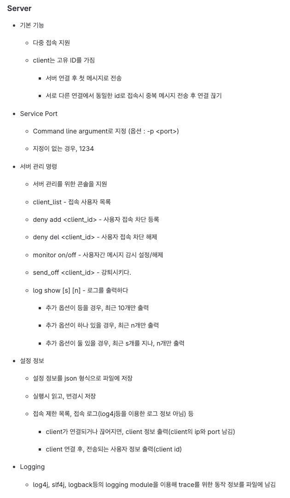
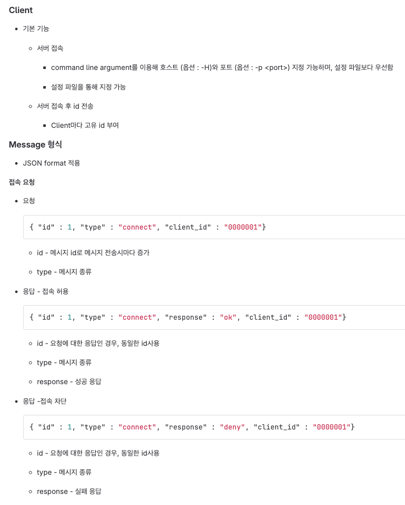
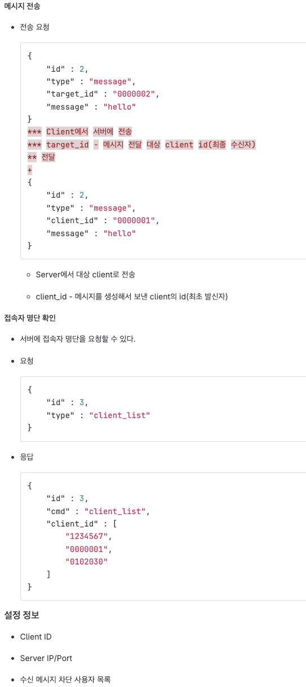

# 절차
1. 다대일 통신을 할 수 있는 소켓 마련 - 메세지 주고 받는 것 확인

2. 메세지를 JSON 형식으로 바꾸기

3. 이후에 다른 것들을 더 생각해 보자.

# 당장 할 것
1. 서버에 치면 모든 사용자에게 말하기.
- 클라이언트를 리스트로 가지고 있어야함
- 리스트를 순회하면서, 모든 클라이언트의 OutputStream에 넣기

---

---

### 서버
- 

---

### 클라이언트
- 

---
[요구사항]

